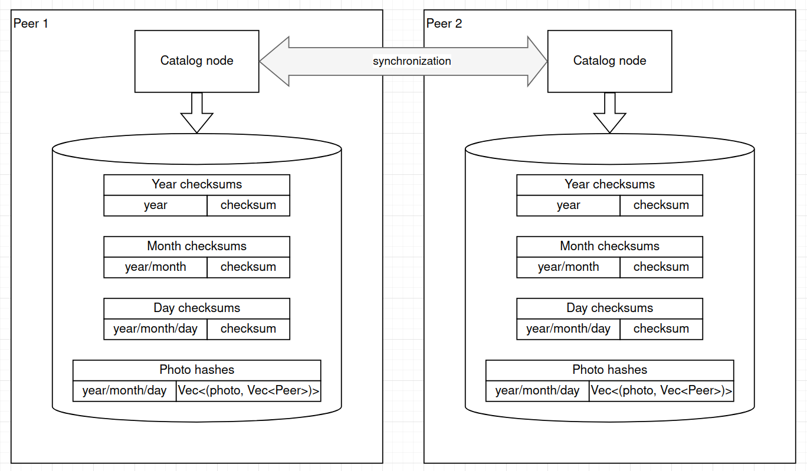

# Photo sync test app

This is a test project that represent a prototype of a distributed storage
for storing binary objects (photos in our case).

## General idea of the storage

Multiple peers have a common collection of photos, and want to have a distributed catalog
that helps to identify which peer contains a photo file.

Photos are partitioned by the day, when were taken,
e.g. in "folders" like `"2020-11-15"``, `"2020-11-16"``, etc.

Inside of each "folder" photos are uniquly identified by their SHA256 hashes.

Peers can synchronize catalog parts one with each other to keep the local copy of catalog complete.

For simplicity we assume that photos are never edited, i.e. their hashes never change.

We don't consider that someone bad might pretend to be our friend and try to provide "bad" hashes.

## Storage and syncronization 



To speed up the synchronization we introduce 3 levels of checksums:

* **Day checksum** - hash of all object IDs for given year-month-day
* **Month checksum** - hash of all day checksums in this month
* **Year checksum** - hash of all month checksums in this year

This tree-like checksum structure allows us to quickly identify discrepancies in the hierarchy. To find year-month-day partitions that should be synchronized, we:

1. Check all year checksums of two peers. This is a quick and cheap operation because there is not much years we have. If for corresponding years chechsums are same, then it means that all year-month-day partitions in this year are same (already in sync).
2. If the checksum for a year is different, then for both peers we compare checksums for all the months in this year.
3. For months that have different checksums we repeat same comparison for day checksums.
4. Days that have different checksums are synchronized between peers by trasfering of the whole day data (it is not much) between peers.

To maintain this structure, when a change is made for a year-month-day partition, we reculculate the whole chain of checksums upside from the day to the year level.

## Implementation details

The codebase represent a library that includes:

* [**Local storage**](src/local_storage.rs) which is build using [redb](https://github.com/cberner/redb) (pure Rust analogue of RocksDB)
* [**Catalog node**](src/catalog.rs) which wraps the LocalStorage and provides the synchronization functionality

The implementation is limited to the Catalog functionality only and allows:

* add new photos
* perform syncronized with other peers

There is no network interaction or scheduling provided. This functionality can be "easily" added by implementing `RemotePeer` trait.
Yet, we can connect a set of peers one with each other and perform the synchronization, see the [integration test](tests/catalog_test.rs).

## Build and test

Make sure you have [Rust and Cargo installed](https://www.rust-lang.org/tools/install).

Navigate to the project root folder and execute:

```shell
cargo build
cargo test
```